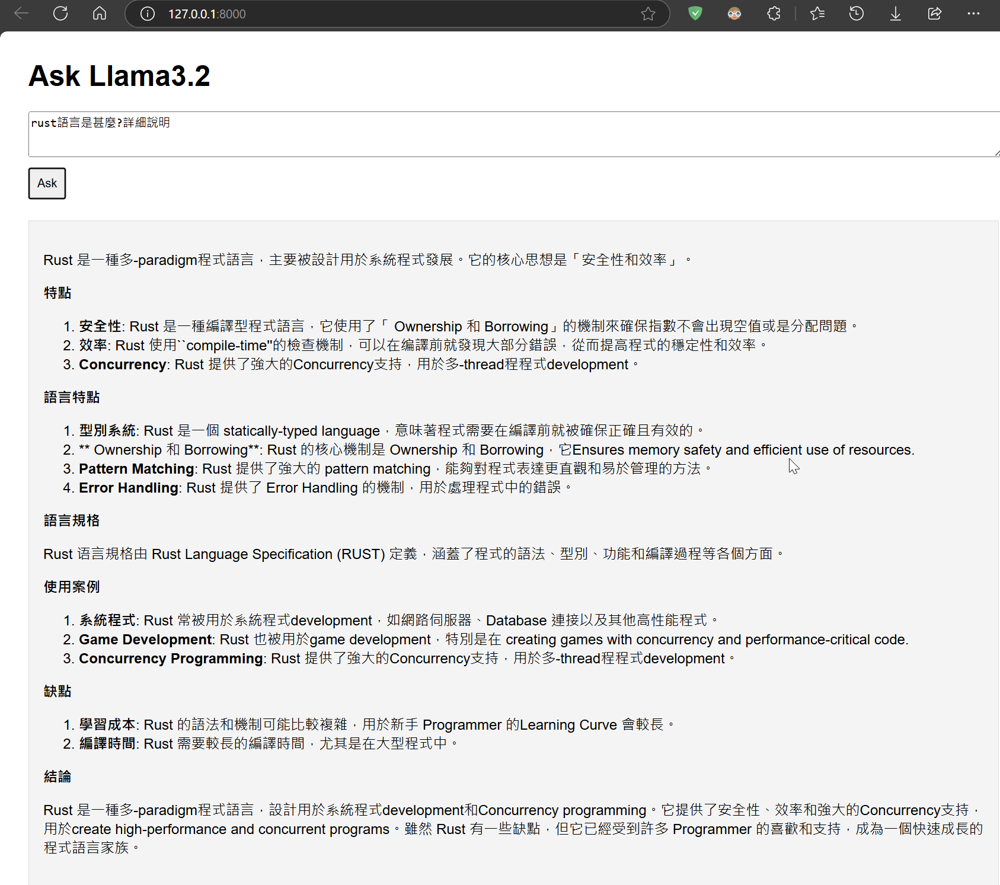

# ollama sample 
with node.js backup and front and

## pre install
  1. install ollama:
  2. pull llama3.2:
```bash
sh preinstall.sh
```

### backend
  1. yarn install required packages:
```bash
sh yarn-add-ollama.sh
```
  2. run with: node server.js
```bash
sh start-backup.sh
```

### frontend
  1. install http-server
```bash
sh npm-install.sh 
```

  2. run frontend: http-server 
```bash
sh start-http.sh
```


